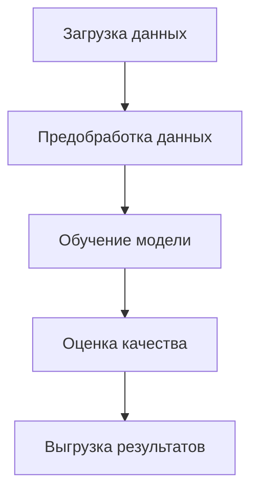
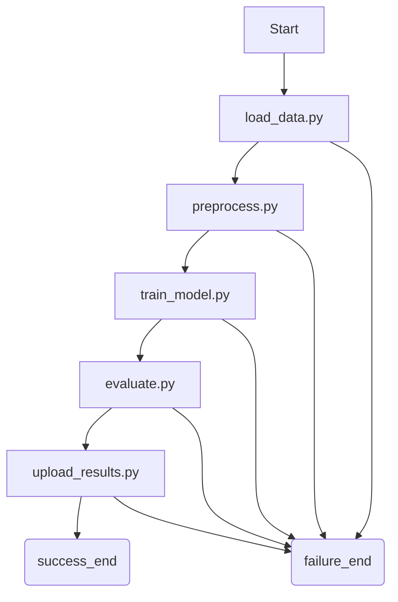

# Автоматизация и оркестрация ML-пайплайна для диагностики заболевания

## Цель проекта
Разработать и автоматизировать ETL-процесс для построения модели машинного обучения, диагностирующей рак молочной железы, с использованием Apache Airflow и Python.
Модель классифицирует опухоли как доброкачественные (0) или злокачественные (1) на основании биометрических признаков.

## Описание данных
- Источник: Breast Cancer Wisconsin Diagnostic Dataset
- Формат: CSV
- Ссылка: https://raw.githubusercontent.com/selva86/datasets/master/BreastCancer.csv
- Целевая переменная: Class (0 - доброкачественная / 1 - злокачественная опухоль)

## Для начала работы
После копирования репозитория, создайте файл .env в корне проекта и заполните его в соотвествии с шаблоном:
```env
# Данные для PostgreSQL (используется Airflow)
POSTGRES_USER=airflow
POSTGRES_PASSWORD=airflow
POSTGRES_DB=airflow

# Ключ для Web UI Airflow (замените на собственный)
AIRFLOW__WEBSERVER__SECRET_KEY=myultrasecretkey123

# Путь до JSON-файла сервисного аккаунта Google (для загрузки результатов)
GOOGLE_APPLICATION_CREDENTIALS=/opt/airflow/secrets/credentials.json

# ID папки Google Drive, куда выгружаются артефакты модели (замените на собственный)
GDRIVE_FOLDER_ID=1dN_kiXE90a94alksON24793773--plkad
```
Для тестирования/проверки etl-py-файлов можно использовать makefile-команды:
```
make install-requirements
```
Устанавливает необходимые зависимости в активную виртуальную среду (.venv, miniconda)

Далее можете воспользоваться командами для запуска кокретного скрипта:
```
make local-load
```
```
make local-preprocess
```
```
make local-train
```
```
make local-evaluate
```
```
make local-upload
```
Запуск всех скриптов:
```
make local-test-all
```

Сборка и запуск контейнеров (фоновый)
```
docker-compose up --build -d
```

Запуск контейнеров (фоновый)
```
make up
```
Доступ к web-интерфейсам (логин:пароль - admin:admin):
- Airflow Web UI: ```http://localhost:8080```
- Prometheus: ```http://localhost:9090```
- Grafana: ```http://localhost:3000```

Остановка и удаление контейнеров
```
make down
```

[Подробнее о makefile-командах](#makefile-команды)

---
---

## Последовательность исполнения задач в пайплайне

## Структура DAG и зависимости

Каждый шаг связан через depends_on_past=True или направленный граф, обеспечивая строгий порядок выполнения. При любом падении одна из задач вызовет failure_end.
Все задачи логируют события через модуль utils/logger.py и перенаправляют вывод в airflow/logs/. Пример логирования:
```
logger = get_logger("train_model")
logger.info("Начинаем обучение модели...")
```
Пайплайн настроен на однократный запуск (режим @once). Это позволяет вручную запускать DAG по мере необходимости, без автоматического расписания.
```
schedule_interval="@once"
```
Также при запуске сервисов реализован автоматический unpaused дагов. Нет необходимости переходить в интерфейс и размораживать вручную. Подробнее можно узнать, изучив файл [entrypoint.sh](airflow/entrypoint.sh)

## Описание компонентов
| Компонент | Описание |
|-------------------|-------------------------------------------------------------------------------|
| [load_data.py](airflow/etl/load_data.py) | Загружает CSV-файл с медицинскими данными и сохраняет в локальный каталог |
| [preprocess.py](airflow/etl/preprocess.py) | Выполняет очистку данных, стандартизацию и разбивку на train/test |
| [train_model.py](airflow/etl/train_model.py) | Обучает логистическую регрессию и сохраняет модель |
| [evaluate.py](airflow/etl/evaluate.py) | Вычисляет метрики классификации и сохраняет в JSON |
| [upload_results.py](airflow/etl/results.py) | Загружает результаты (модель + метрики) в Google Drive и локально |

## Анализ ошибок и устойчивости (Robustness)
Проект спроектирован с учетом устойчивости к сбоям на каждом этапе выполнения ETL-процесса.
### Где может «упасть» процесс?
| Этап | Возможные сбои |
|-------------------|-------------------------------------------------------------------------------|
| load_data.py | Сбой соединения с URL-источником или неверный путь |
| preprocess.py | Обнаружение пропусков или структурных ошибок в колонках |
| train_model.py | Ошибки во входных данных, переобучение, несовместимость модели |
| evaluate.py | Отсутствие модели или разметки, деление на 0 |
| upload_results.py | Ошибка авторизации, недоступность Google Drive API |

### Какие исключения могут возникнуть?
- ConnectionError, TimeoutError при загрузке данных
- ValueError при валидации схемы (pandera)
- FileNotFoundError при отсутствии файла модели
- PermissionError при работе с Google API без валидного токена
- TypeError или ZeroDivisionError при расчёте метрик

### Что происходит при сбое?
- Используются retries и retry_delay в большинстве задач, что обеспечивает автоматическую повторную попытку выполнения.
- Установлены execution_timeout, чтобы задача не зависала.
- Последняя задача DAG’а (failure_end) срабатывает при любом частичном сбое благодаря TriggerRule.ONE_FAILED, что позволяет обработать падение корректно.

### Поведение системы
| Ситуация | Механизм устойчивости |
|-------------------|-------------------------------------------------------------------------------|
| Источник данных недоступен | Повтор загрузки через retries=3 |
| preprocess.py | Валидация схемы через pandera |
| Модель не обучается (например, NaNs после нормализации) | Исключения фиксируются, пайплайн прерывается |
| Сбой при выгрузке на Google Drive | Повторная попытка, логгирование ошибки |
| Задача зависает более 10 минут | execution_timeout завершит выполнение |

### Реализованные средства устойчивости
- Логгирование на всех этапах (utils.logger)
- Retries + retry_delay на задачах load_data, train_model, upload_results
- Timeouts: защита от зависания (execution_timeout)
- Валидация схемы данных: Pandera проверяет структуру на этапе preprocess.py
- Изоляция функций: каждая задача — отдельный модуль
- Failure endpoint: failure_end отрабатывает независимо от success_end
- Отчет об ошибке GDRIVE_FOLDER_ID через лог и ValueError

### Способы улучшить
| Улучшение | Описание |
|-------------------|-------------------------------------------------------------------------|
| Email-уведомление | Добавить on_failure_callback, например notify_failure(context) |
| Тесты входных данных | Автоматическое сравнение схемы входа до запуска пайплайна |


## Интеграция с хранилищем (Google Drive)

После завершения всех шагов пайплайна (train_model.py, evaluate.py) формируются:
- model.joblib — сериализованная модель (Logistic Regression)
- metrics.json — метрики качества (Accuracy, Precision, Recall, F1)

Они сохраняются в папке results/ (backup в upload/), а затем автоматически загружаются в облачное хранилище.

---

### Как реализована авторизация

Для безопасного доступа к Google Drive используется сервисный аккаунт, предоставляющий машинный доступ от имени проекта.
- drive_sa.json — ключ сервисного аккаунта (JSON), хранится в папке secrets/
- Авторизация происходит через библиотеку google-auth и google-api-python-client

---

### Необходимые переменные окружения
- GDRIVE_FOLDER_ID — ID папки на Google Drive, куда будет производиться выгрузка.
Пример: 1dN_kiXE90a94alksON24793773--plkad (предварительно для сервисного аккаунта необходимо предоставить доступ к папке)
- GOOGLE_APPLICATION_CREDENTIALS — абсолютный путь к файлу drive_sa.json.
Пример в .env:
GOOGLE_APPLICATION_CREDENTIALS="/opt/airflow/secrets/drive_sa.json"

---

### Как работает загрузка

Файл etl/upload_results.py использует функцию upload_to_storage(...), которая:
- Проверяет наличие файлов в results/
- Аутентифицируется через сервисный аккаунт
- Создаёт подпапку с меткой времени внутри GDRIVE_FOLDER_ID (например, 20250611_210512)
- Загружает в неё model.joblib и metrics.json
- Логирует результат с помощью utils/logger.py

### Результат
https://drive.google.com/drive/folders/1dN_kiXEhOI4ilksON24Azc7b3--pUlgH?usp=sharing


---

## Airflow


## Prometheus
Система мониторинга и сбора метрик, которая опрашивает сервисы (включая Airflow) и собирает числовые данные (время ответа, число задач, загрузка CPU и др.), чтобы потом анализировать их или визуализировать через Grafana.


## Grafana
Grafana подключается к Prometheus и позволяет наблюдать за состоянием ETL-пайплайна:
- Сколько DAG-ов завершились успешно/с ошибкой
- Состояние scheduler`a


## Makefile команды
### Установка зависимостей
```
make install-requirements
```
Устанавливает зависимости из test/requirements.txt. Используется для локального запуска скриптов вне Airflow. Зависимости устанавливаются в активную виртуальную среду (.venv, miniconda)

### Управление контейнерами
```
make up
```
Запускает все контейнеры Airflow (init, webserver, scheduler, triggerer, postgres) + Prometheus (statsd-exporter) + Grafana.

```
make down
```
Останавливает и удаляет все контейнеры.

### Просмотр логов
```
make logs
```
Показывает последние 100 строк логов всех сервисов.

```
make logs-webserver
make logs-scheduler
make logs-triggerer
```
Выводят логи отдельных сервисов Airflow: webserver, scheduler, triggerer.

### Локальное выполнение шагов пайплайна
Каждая команда запускает соответствующий скрипт без Airflow, напрямую из Python.
```
make local-load
```
Загружает датасет BreastCancer.csv из интернета и сохраняет в airflow/data/raw.csv.

```
make local-preprocess
```
Предобработка данных: удаление пропусков, масштабирование признаков, разбиение на train/test, сохранение в .joblib.

```
make local-train
```
Обучает модель LogisticRegression на подготовленных данных. Сохраняет модель в airflow/results/model.joblib.

```
make local-evaluate
```
Оценивает модель на тестовой выборке. Сохраняет метрики (Accuracy, Precision, Recall, F1) в airflow/results/metrics.json.

```
make local-upload
```
Загружает модель и метрики в Google Drive, используя drive_sa.json и GDRIVE_FOLDER_ID. Также сохраняет копии в airflow/uploaded.

```
make local-test-all
```
Полный прогон всех этапов пайплайна без Airflow:
- Загрузка данных
- Предобработка
- Обучение
- Оценка
- Выгрузка
